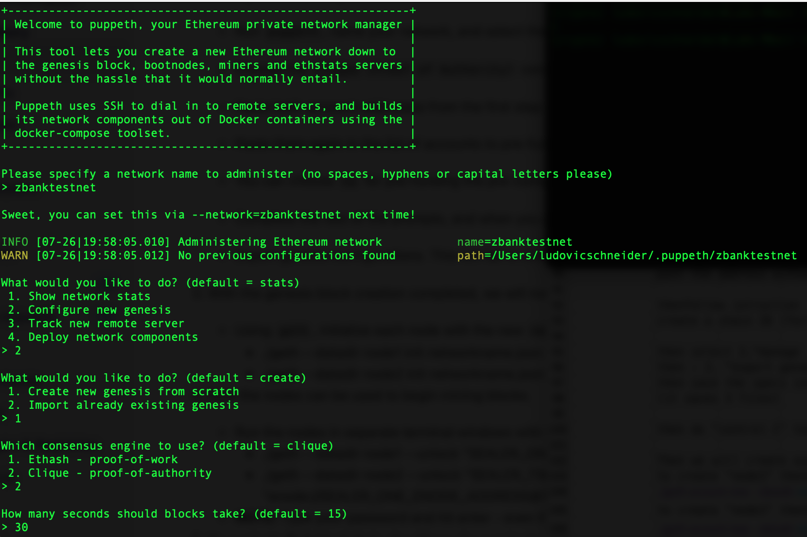
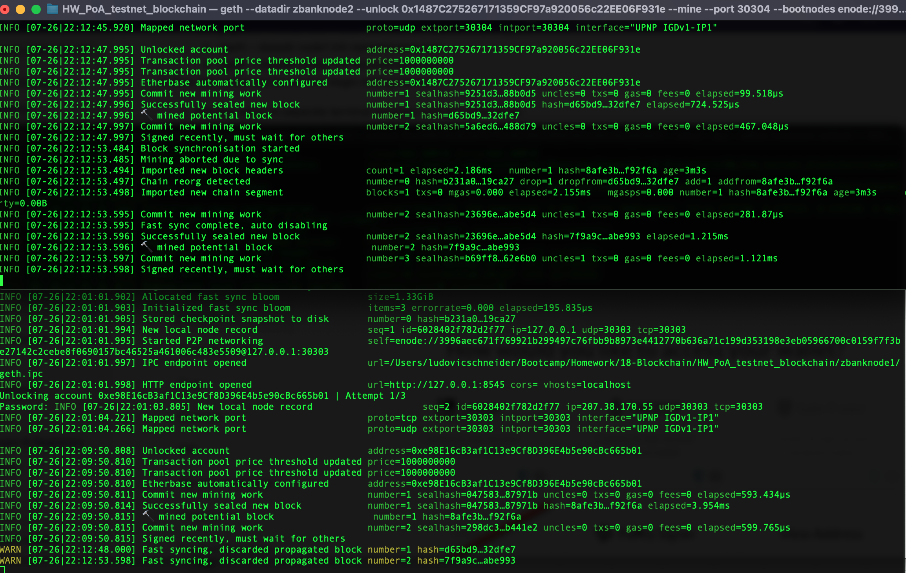
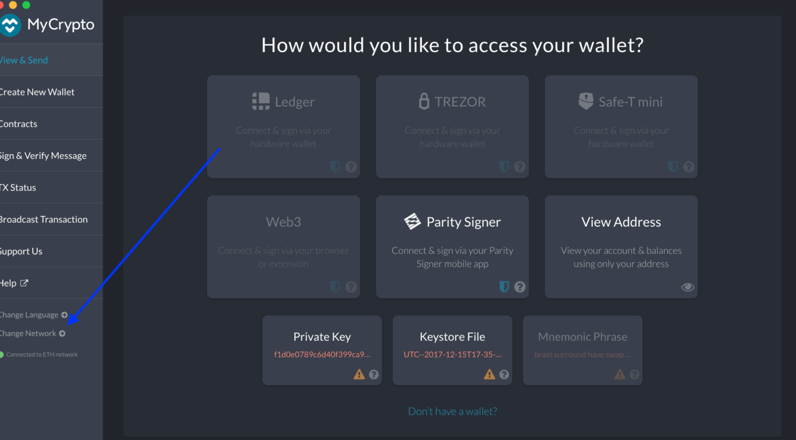
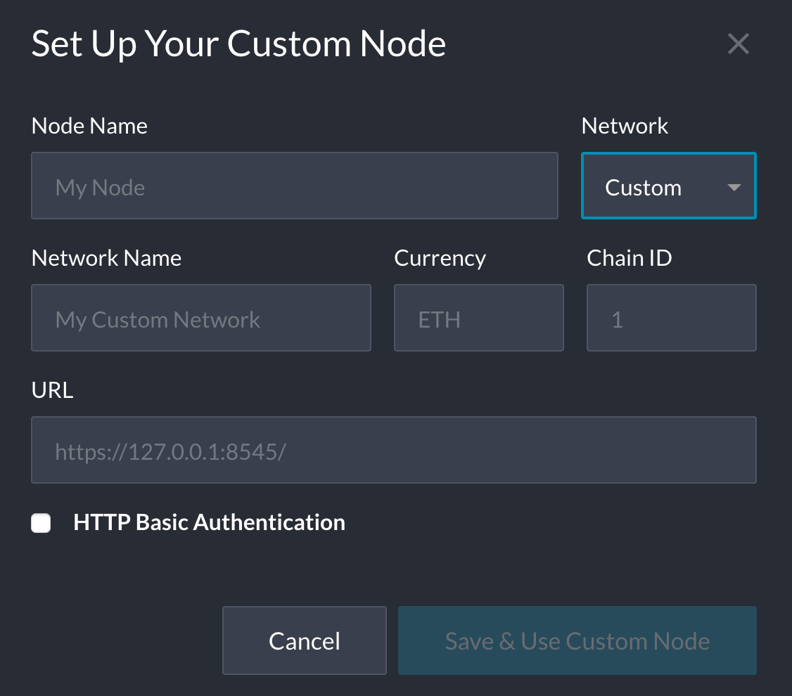
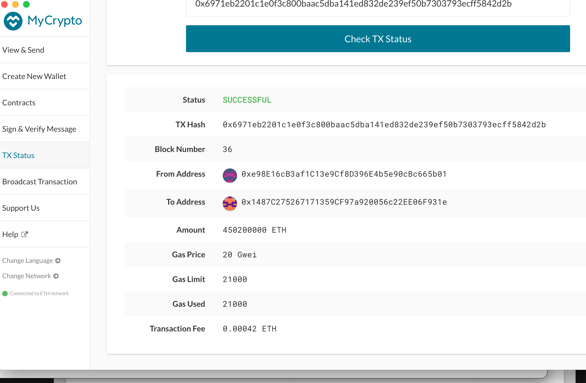
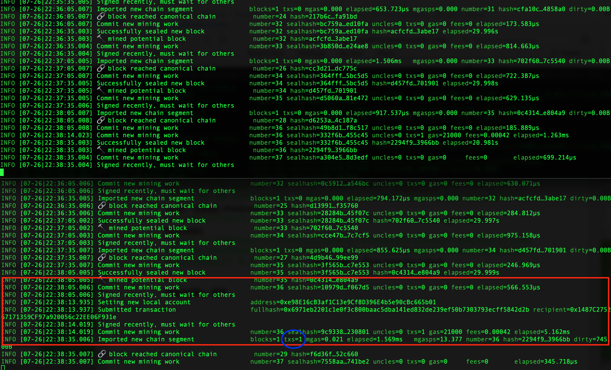

# HW_PoA_testnet_blockchain
## Background
The purpose of this project is to understand how a blockchain network works. Like anything else, the best way to learn is to practice and experiment in real life.

We will set up a private testnet blockchain, allowing you to explore and experiment how an ethereum network works offline. This also remove the "money" constraint as the ETH used on your private network have of course no value. You will then be able to send transaction and fully explore the potential of the network. 
In this project we will use a Proof of Authority (PoA) consensus. 

To set up the network, we will : 
* Create your nodes using : __Geth__
* Setup your network parametters by generating the rules in your genesis block using : __Puppeth__ 
* Use your cryptocurrency wallet to send transactions

## Dependencies

You will need to install : 
* __Geth__ : via their link [Go Ethereum](https://geth.ethereum.org/downloads/)
It is important to note that you will need to keep Geth files in the same folder you will be running your network/nodes. 

Have an Ethereum based wallet like MyCrypto which you will use to both check you balances and submit transaction from one of your node directly or an independent wallet. 

## Setting up your testnet Network
All the settings will be done out of your command-line tool directly. 

### Step 1: Create your nodes (minimum two as you need a consensus)
In your command-line, go into the folder in which you have Geth installed. 
   * Run the code : _./geth account new --datadir yournodename_
   * Follow the prompts, note the password will be needed to initialize and unlock your node each time you want to run your testnet blockchain. 
(Repeat this operation for each node you want to create - you will need your pair of keys to initialize the node)

### Step 2: Generate your genesis block which will contain all your blockchain rules.

Run the commande _./puppeth_

Follow the prompts and select the below options : 
1. Type the name of the new network
2. select : Configure new genesis
3. select : create a new genesis
4. select the consensus we want in our case PoA

Then put the initial wallet you want pre-funded with the genesis block. We need to do this in PoA as there are no block rewards in PoA, so you'll need to pre-fund your nodes.
past the address without the 0x (already in)

Create a chain ID (for testing purposes we took simpe one but in prod just do random) Then you need to export the config by following the below steps:

5. select : manage existing genesis
6. select : export genesis configuration
7. save the specs in the same folder by just pressing enter
(it saves 3 files but when for a PoA chain, it creates only the genesis file : networkname.json).

Then do "control C" to exit puppeth (the config manager)

### Step 3: Initialize the nodes with the genesis json file that was created in step2
   Run the command below for each node :
   _./geth --datadir node1 init networkname.json_ 

### Step 4: Starting up the blockchain
Run the nodes in separate terminal windows with the commands:
* For node 1 : 
  * Unlock with the node address (publick key)
  * "mine" : the --mine flag will tell the node to mine
  * "rpc": The --rpc flag enables us to talk to our second node, which will allow us to use MyCrypto or Metamask to transact on our chain.

_./geth --datadir node1 --unlock "SEALER_ONE_ADDRESS" --mine --rpc --allow-insecure-unlock_

* For node 2 :
  * For the second node we will need to use a different port since the first one is already using the default one = 30303. hence we use the 30304.
  * "bootnodes" : The --bootnodes flag allows you to pass the network info needed to find other nodes in the blockchain. This will allow us to connect both of our nodes. Basically need to retrieve the enode from the first node available when activating it.
  * "ipcdisable" : Disable the IPC-RPC server as we already flagged on the first node.
  

_./geth --datadir node2 --unlock "SEALER_TWO_ADDRESS" --mine --port 30304 --bootnodes "enode://SEALER_ONE_ENODE_ADDRESS@127.0.0.1:30303" --ipcdisable --allow-insecure-unlock_

### Step 5: Send two test transactions
1. Connect your network to a wallet in our case we used MyCrypto
   In MyCrypto - you will have to change network and select "create a custom node". 

Make sure to use http://127.0.0.1:8545 (instead of https) as the URL, select  ETH as the currency, and the Chain ID of the network.

2. Connect one or both nodes to your wallet - to unlock them use either your private key or Keytstore file.

3. Send a transaction and its confirmation
Follow the prompts and you will end up with the below confirmation if your network is running/mining. 

First Transaction

Second Transaction

Don't forget to look into your nodes to see how the transaction is being mined. 

